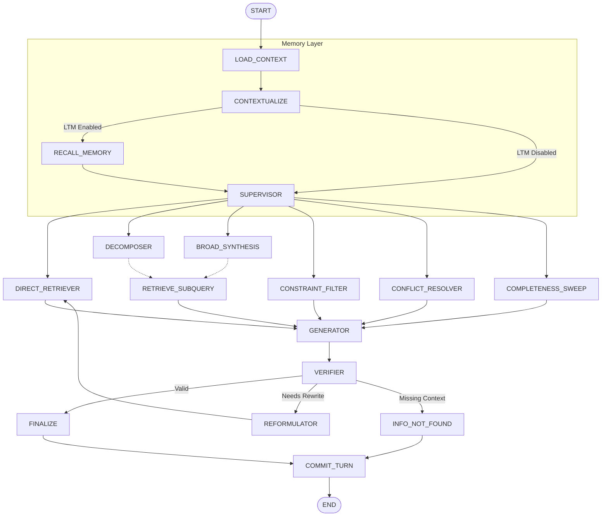

# RAG Agent Architecture

```mermaid
flowchart TD
    START([START]) --> LOAD_CONTEXT

    subgraph Memory_Layer["Memory Layer"]
        LOAD_CONTEXT --> CONTEXTUALIZE
        CONTEXTUALIZE -->|LTM Enabled| RECALL_MEMORY
        CONTEXTUALIZE -->|LTM Disabled| SUPERVISOR
        RECALL_MEMORY --> SUPERVISOR
    end

    SUPERVISOR --> DIRECT_RETRIEVER
    SUPERVISOR --> DECOMPOSER
    SUPERVISOR --> BROAD_SYNTHESIS
    SUPERVISOR --> CONSTRAINT_FILTER
    SUPERVISOR --> CONFLICT_RESOLVER
    SUPERVISOR --> COMPLETENESS_SWEEP

    DECOMPOSER -.-> RETRIEVE_SUBQUERY
    BROAD_SYNTHESIS -.-> RETRIEVE_SUBQUERY

    RETRIEVE_SUBQUERY --> GENERATOR
    DIRECT_RETRIEVER --> GENERATOR
    CONSTRAINT_FILTER --> GENERATOR
    CONFLICT_RESOLVER --> GENERATOR
    COMPLETENESS_SWEEP --> GENERATOR

    GENERATOR --> VERIFIER

    VERIFIER -->|Valid| FINALIZE
    VERIFIER -->|Needs Rewrite| REFORMULATOR
    VERIFIER -->|Missing Context| INFO_NOT_FOUND

    REFORMULATOR --> DIRECT_RETRIEVER

    FINALIZE --> COMMIT_TURN
    INFO_NOT_FOUND --> COMMIT_TURN
    COMMIT_TURN --> END([END])
```